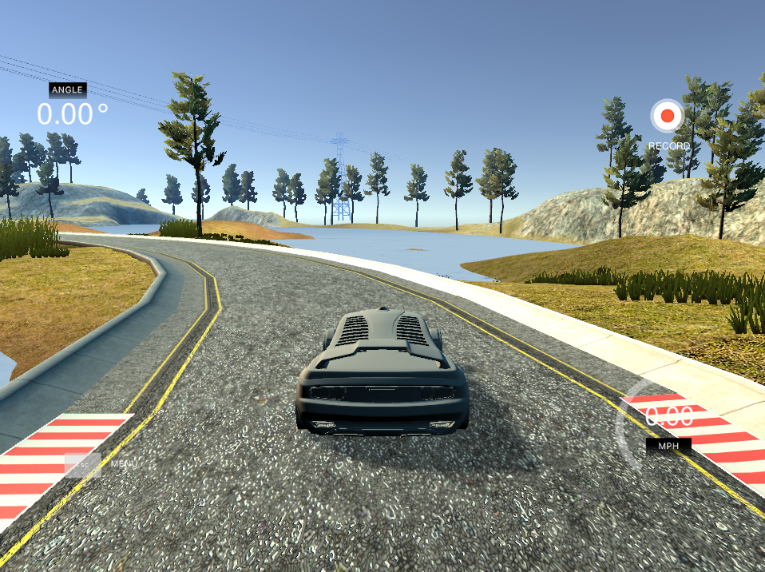

# CarND-Controls-MPC

---

## Overview

In this project I implemented a Model Predictive Controller (MPC) in C++ to maneuver the vehicle around the track in simulator. A short demo video is [here](https://youtu.be/Z9DPFt2bBQk).

The simultor provides information each time step:
* ptsx (x-position of waypoints ahead on the track in global coordinates)
* ptsy (y-position of waypoints ahead on the track in global coordinates)
* px (current x-position of the vehicle's position in global coordinates)
* py (current y-position of the vehicle's position in global coordinates)
* psi (current orientation angle of the vehicle, converted from the simulator's format to that expected in mathematical formulas)
* v (current velocity of the vehicle)
* delta (current steering angle of the car)
* a (current throttle)

**MPC steps:**

* Define the prediction horizon - the duration over which future predictions are made. `N` is the number of timesteps in the horizon, `dt` is how much time elapses between actuations.
* Define state variables and actuators constraints.
* Define the cost function.

* Fit a line based on road waypoints and evaluate the current state based on that polynomial line.
* Take into account 100 ms latency (simply predict the state in 100 ms in future).
* Pass this state as initial state to the MPC.
* Using Ipopt library use optimization solver that returns the vector of control inputs that minimizes the cost function.
* Apply the first control input to the vehicle.
* Repeat from the beginning.

## The Model

The Controller uses a simple kinematic model. Kinematic models are simplifications of dynamic models that ignore tire forces, gravity, and mass. This simplification reduces the accuracy of the models, but it also makes them more tractable. At low and moderate speeds, kinematic models often approximate the actual vehicle dynamics.

The kinematic model can predict the state on the next time step by taking into account the current state and actuators as follows:

Where:

Position (x,y), heading (ψ) and velocity (v) form the vehicle state vector [x,y,ψ,v].

Errors - cross track error (cte) and ψ error (eψ).

Two actuators [δ,a] - 1. stearing angle (δ) (should be in range [-25,25] deg); 2. for simplicity the throttle and brake represented as a singular actuator (a), with negative values signifying braking and positive values signifying acceleration (in range [-1,1]).

## Polynomial Fitting and Latency

At the beginning of the every step the waypoints are preprocessed by transforming them from global coordinates to vehicle coordinates. This simplifies the process of fitting a polynomial to the waypoints because the vehicle's x and y coordinates are now at zero as well as the orientation angle. 

After that, we use the state update equations to predict next state in 100 ms in to the future in order to deal with latency. That predicted state we pass to MPC solver.

## Prediction Horizon

Another important step is to choose the prediction horizon - the duration over which future predictions are made. `N` is the number of timesteps in the horizon, `dt` is how much time elapses between actuations. By trial and error I found that `N = 10` and `dt = 0.15` work best for my model. Initially I used proposed in lessons N = 10 and dt = 0.1 and these values produced a good result on lower speed, however when I tried to increase speed limit, the car started to oscillate heavily. It turned out that if I predict slightly far in the future the car goes smoothly.

## Dependencies

* cmake >= 3.5
* make >= 4.1 
* gcc/g++ >= 5.4
* uWebSocketIO

[This](https://github.com/udacity/CarND-MPC-Project) repository contains all instructions for the Project.

* **Ipopt and CppAD:** Please refer to [this document](https://github.com/udacity/CarND-MPC-Project/blob/master/install_Ipopt_CppAD.md) for installation instructions.
* [Eigen](http://eigen.tuxfamily.org/index.php?title=Main_Page). This is already part of the repo so you shouldn't have to worry about it.
* Simulator. You can download these from the [releases tab](https://github.com/udacity/self-driving-car-sim/releases).
* Not a dependency but read the [DATA.md](./DATA.md) for a description of the data sent back from the simulator.

## Basic Build Instructions

1. Clone this repo.
2. Make a build directory: `mkdir build && cd build`
3. Compile: `cmake .. && make`
4. Run it: `./mpc`.

